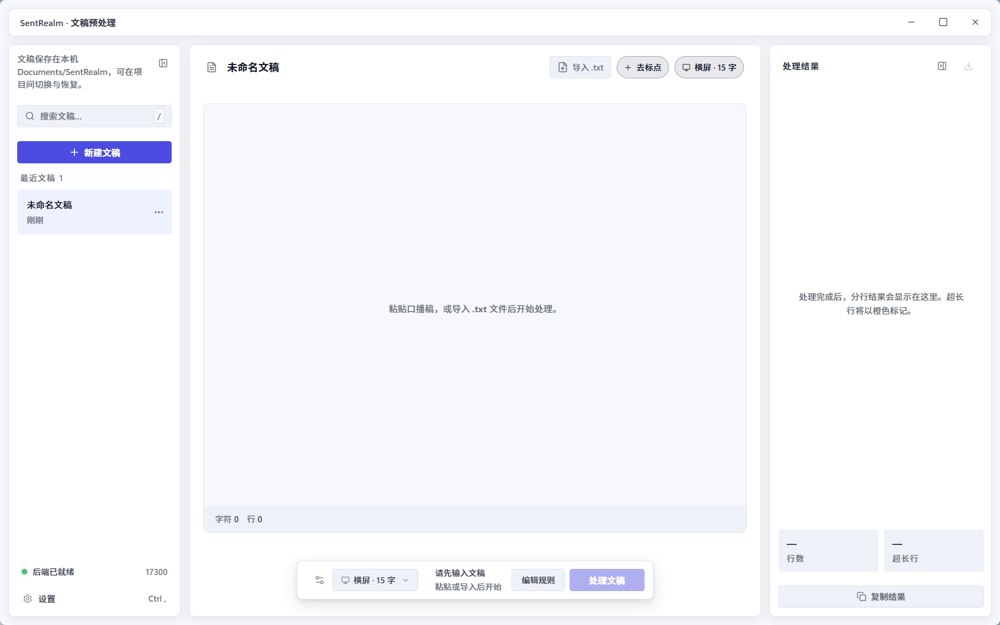

<p align="center">
  
</p>

<h1 align="center">SentRealm</h1>

<p align="center">
  面向视频创作者的<strong>文稿预处理</strong>桌面工具<br>
  粘贴到剪映「文稿匹配」之前，自动去标点、智能断句与分行
</p>

<p align="center">
  Windows 10 / 11 · 文稿本地处理 · 桌面壳 <code>1.0.0</code>
</p>

<p align="center">
  
</p>

## 它解决什么问题

剪映「文稿匹配」若直接粘贴原始口播稿，字幕里常会留下逗号、句号，单条也容易过长，只能在时间轴上逐条改。SentRealm 把**已确认的口播 / 解说稿**转成剪映友好的一行一条纯文本，复制即可用。

它**不会**改写文案、对接剪映工程、导出 SRT，或做语音转写。交付物是可复制（也可导出 `.txt`）的纯文本。

## 核心能力

| 能力 | 说明 |
|------|------|
| 去标点、不断错意 | 句末符号形成自然句；逗号等只在超长时作为断点；引号 / 括号只删除。默认保留 `%` `.`（如 `增长50%`、`1.86`） |
| 规则断句 + 可选 LLM | 横屏 15 字 / 竖屏 10 字预设；规则层按候选边界全局选点并修复短行。切不干净的超长行可再走 LLM 语义切分（不改用词、不上传全文） |
| 对照预览 | 右侧实时显示分行结果与行数；超长行橙色标记，点击可定位原文 |
| 本机工作区 | 文稿在 `Documents/SentRealm`，配置在本机 SQLite；无云端账号 |
| 多入口 | 桌面 GUI、CLI、MCP 共用同一套处理逻辑与配置 |

处理规则细节见 [产品定义与 MVP](./docs/planning/01-product-definition-and-mvp.md)。

## 怎么用

1. 粘贴定稿，或导入 `.txt`
2. 选择横屏 15 / 竖屏 10 / 自定义字数
3. 点击 **处理文稿**
4. 扫一眼橙色超长行，复制或导出结果
5. 粘贴到剪映 **文本 → 智能字幕 → 文稿匹配**

完整操作、参数与常见问题见 [用户使用手册](./docs/user/README.md)。

## 当前状态

M1–M3 已完成；桌面壳 **`1.0.0`**。Windows NSIS 安装包可本地构建；代码签名、干净机冒烟与公开发布仍待完成——未签名安装包可能被 SmartScreen 提示。

下一优先见 [路线图](./docs/planning/03-roadmap.md)。

## 开发者快速开始

前置：Windows（主平台）、**uv** **0.12.1**（项目 `.venv` 使用 Python **3.12.13**）、Node **24.18.1**、pnpm **11.15.0**、Rust **1.97.1**。系统 Python 版本不作为项目基准，详见 [docs/dev/setup.md](./docs/dev/setup.md)。

```bash
uv sync
pnpm install
pnpm dev
```

- 一键启动后 Tauri 自动拉起 FastAPI（`127.0.0.1:17300`），无需第二个终端
- IDE 断点调试（F5）：见 [docs/dev/running-locally.md](./docs/dev/running-locally.md) 的「IDE 调试」一节
- 仅调试 API：`uv run uvicorn apps.gui.api.main:app --host 127.0.0.1 --port 17300`
- 测试：`uv run pytest`

**产品形态**：Tauri 2 + React + Python（FastAPI）；业务断句逻辑在 `packages/core`。

## 文档索引

| 读者 | 文档 | 说明 |
|------|------|------|
| 使用者 | [docs/user/](./docs/user/README.md) | 写稿 → 处理 → 剪映 |
| 产品 | [docs/planning/](./docs/planning/README.md) | 产品范围、用户故事、路线图 |
| 架构 | [docs/architecture/](./docs/architecture/README.md) | 分层、模块边界、ADR |
| 契约 | [docs/api/](./docs/api/README.md) · [cli-mcp](./docs/cli-mcp.md) | HTTP / CLI / MCP |
| 开发 | [docs/dev/](./docs/dev/README.md) | 环境、运行、测试、安装包 |
| UI | [docs/ui/](./docs/ui/README.md) | tokens、三栏壳、组件映射 |
| Agent | [AGENTS.md](./AGENTS.md) | AI / 自动化协作约定 |
