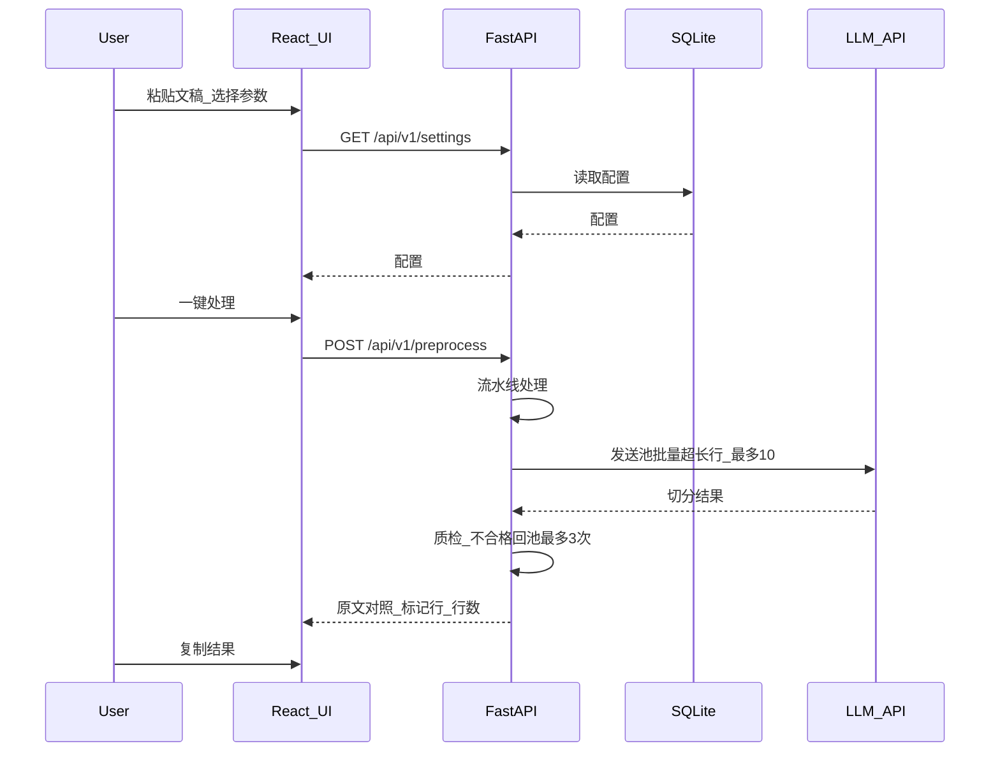
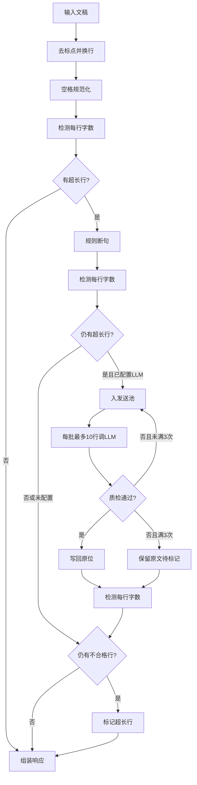

# 数据流与模块边界

> 业务规则以 [产品定义与 MVP](../planning/01-product-definition-and-mvp.md) 为准；系统分层见 [架构概览](./overview.md)；四模块划分见 [多入口模块化架构](./modules.md)。

## 用户操作流

从前端输入到剪贴板输出的完整路径：



| 步骤 | 说明 |
|------|------|
| 加载配置 | 应用启动或打开设置页时，前端从 API 读取 SQLite 中的持久化配置 |
| 输入文稿 | 用户粘贴文本或通过 Tauri 导入 `.txt` 文件 |
| 处理 | 前端将文稿 + 当前参数提交给 `POST /api/v1/preprocess` |
| 预览 | 展示原文与处理后对照、行数统计、超长标记行高亮 |
| 输出 | 用户一键复制处理结果到剪贴板，粘贴至剪映「文稿匹配」 |

参数变更（横竖屏预设、自定义字数、去标点规则）可通过 `PUT /api/v1/settings` 写回 SQLite，下次启动自动恢复。

## 预处理流水线

对齐 [产品定义：断句处理流程](../planning/01-product-definition-and-mvp.md)：

```
去标点（去除位置换行） → 空格规范化
    ↓
检测每行字数
    ↓
超出限制的行 → 规则断句换行
    ↓
检测每行字数
    ↓
仍超出的行 → 入 LLM 发送池（未配置 API 时跳过，直接标记）
    ↓
分批（最多 10 行）→ LLM 断句 → 写回 → 质检 / 返工（每行最多 3 次）
    ↓
检测每行字数 → 仍不合格 → 标记（不再自动处理）
```



| 步骤 | 执行模块 | 外部依赖 | 说明 |
|------|----------|----------|------|
| 1. 去标点并换行 | `pipeline/punctuation.py` | 无 | 去除标点在原位置换行；默认保留 `%` `％` |
| 2. 空格规范化 | `pipeline/whitespace.py` | 无 | 保留英词间、英中文间空格；去除其余 |
| 3. 检测字数 | `pipeline/line_count.py` | 无 | 中文/英文/数字各计 1 字；合并空行 |
| 4. 规则断句 | `pipeline/rule_break.py` | 无 | 仅超长行；字词表白名单（见下文） |
| 5. 检测字数 | `pipeline/line_count.py` | 无 | 同上 |
| 6. LLM 发送池 | `pipeline/llm_break.py` | LLM API | 入池 → 批量 ≤10 → 质检返工；未配置则跳过 |
| 7. 检测字数 | `pipeline/line_count.py` | 无 | 同上 |
| 8. 标记超长行 | `pipeline/` + 前端 | 无 | 返回 `flagged_lines` 索引，UI 高亮 |

流水线由 `pipeline/` 包内编排函数统一调度，各步骤为纯函数或带明确输入/输出的模块，便于单元测试。发送池与质检细则见 [产品定义](../planning/01-product-definition-and-mvp.md#llm-发送池与质检返工) 与 [ADR-005](./adr/005-llm-integration-privacy.md)。

## 黄金样例

以下样例供 `tests/` 与手工验收引用；完整测试分层见 [testing.md](../dev/testing.md)。

### 流水线语义（当前 vs 历史）

当前（Phase 1 / M2 起）`preprocess()` 执行完整 8 步流水线；步骤 6 为 **发送池批量 + 质检返工**（见产品定义）。`flagged_lines` 为规则 + LLM（若启用，含返工耗尽）后仍不合格的行号（**0-based**）。

| 阶段 | `preprocess()` 行为 | `flagged_lines` | 说明 |
|------|---------------------|-----------------|------|
| **当前** | 完整 8 步；LLM 为发送池 ≤10 / 质检 / 最多 3 次 | 放弃或仍不合格的行号 | 产品、ADR-005 与代码一致 |
| **Phase 0（历史 stub）** | `processed` 可与原文相同或仅按 `\n` 拆行 | 恒为 `[]` | 仅脚手架时期；语义已废弃 |

API / cli / mcp 的**字段结构**始终以 [openapi.yaml](../api/openapi.yaml) 与 [cli-mcp.md](../cli-mcp.md) 为准。

### 去标点并换行（步骤 1）

| | 内容 |
|---|------|
| 输入（全文） | `大家好，欢迎来到今天的节目。今天我们聊聊 AI 技术。` |
| 期望输出 | 三行：`大家好` / `欢迎来到今天的节目` / `今天我们聊聊 AI 技术` |
| 要点 | 去除的 `，` `。` 在原位置换行；`AI` 与 `技术` 之间空格保留（步骤 2 再规范化） |

### 空格规范化（步骤 2）

单步测试：输入为**单行**文本，输出为**单行**（步骤 1 之后、断句之前）。

| 输入 | 期望输出 | 要点 |
|------|----------|------|
| `Hello world` | `Hello world` | 英文词间空格保留 |
| `使用 iPhone 拍摄` | `使用 iPhone 拍摄` | 英中文间空格保留 |
| `AI 技术` | `AI 技术` | 英中文间空格保留 |
| `iPhone 15` | `iPhone 15` | 数字与英文间空格保留 |
| `2024 年` | `2024年` | 数字与中文间去除空格 |
| `增长 50 %` | `增长50%` | 数字与 `%` 间无空格；`%` 保留不换行 |

### 规则断句（字词表驱动）

实现约束见下文 [规则断句（字词表）](#规则断句字词表)。以下 `max_chars = 10`，仅示意步骤 4（输入已为单行，不含去标点前置步骤）。

样例 A — 英文词界：

| | 内容 |
|---|------|
| 输入行 | `使用 iPhone 15 拍摄了一段精彩的口播视频` |
| 期望输出（多行） | `使用 iPhone 15`<br>`拍摄了一段精彩的`<br>`口播视频` |
| 要点 | `iPhone` 与 `15` 之间的空格保留；不在 `iPhone` 中间切断 |

样例 B — 避免单字成行：

| | 内容 |
|---|------|
| 输入行 | `这是一个非常重要的技术突破` |
| 期望输出（多行） | `这是一个非常`<br>`重要的技术突破` |
| 要点 | 尽量避免 `的` 等单字单独成行；禁止硬切成 `这是一个非常重` / `要的技术突破` |

单元测试应至少覆盖本节全部样例（无 LLM、有 mock LLM 场景）；约定见 [testing.md](../dev/testing.md)。

### 规则断句（字词表）

字词表定义见 [产品定义：允许断点字词表](../planning/01-product-definition-and-mvp.md#允许断点字词表)。`rule_break.py` 仅在白名单切点处切分，须满足：

| 约束 | 实现要求 |
|------|----------|
| 禁止硬切 | 无白名单切点则保留整行 |
| 英文词界 | 禁止切断英文单词；仅在英文词间空格后切分 |
| 受保护词 | `protected_words.txt` 内的词禁止从中切断 |
| 避免过短成行 | 左右段各至少 `min_chars` 字（设置项；默认 5；**仅规则断句**） |
| 仅处理超长行 | 未超 `max_chars` 的行不改动 |

**选点策略**：`ideal = total / ceil(total / max_chars)`，合法切点中取左段字数最接近 `ideal` 的位置（并列取左段更长）；逐段重复直至合规或无法继续切分。

词表数据：运行时读 SQLite `Settings.break_lexicon`（`resolve_break_lexicon`）；出厂默认与「恢复默认」来自 `packages/core/src/sentrealm_core/data/break_lexicon/*.txt`；加载逻辑：`pipeline/break_lexicon.py`。GUI 经 FAB「编辑规则」写入 Settings。

## core 模块边界

预处理流水线与配置存储位于 **`packages/core`**；HTTP 适配层位于 **`apps/gui/api`**。cli 与 mcp **绕过 HTTP**，直接调用 `core.preprocess()` 与共用 `SettingsStore`（详见 [modules.md](./modules.md)）。

当前目录结构（与仓库对齐）：

```
packages/core/src/sentrealm_core/
  pipeline/
    __init__.py
    preprocess.py      # 编排 / iter_preprocess
    punctuation.py
    whitespace.py
    line_count.py
    rule_break.py
    break_lexicon.py   # 字词表加载与查询
    llm_quality.py     # llm_quality_ok 等
    llm_break.py       # 发送池编排
    flag_lines.py
  data/
    break_lexicon/     # 允许断点字词表（txt，见产品定义）
  models.py            # Settings、PreprocessResult 等领域模型
  workspace_models.py
  store/               # SettingsStore + WorkspaceStore（SQLite / 文件）
  llm.py               # LlmClient、MockLlmClient、OpenAI 客户端
  env.py

apps/gui/api/
  main.py              # FastAPI 入口、CORS
  routes.py            # /health、settings、preprocess、stream、llm-test 等
  workspace_routes.py  # workspace / projects / documents
  schemas.py
  dependencies.py
```

| 模块 | 位置 | 职责 | 边界 |
|------|------|------|------|
| `pipeline/` | core | 预处理流水线全部步骤 | 不访问 HTTP 或数据库 |
| `store/` | core | SQLite 配置与工作区文件读写 | 设置见 ADR-004；文稿资产见 ADR-010 |
| `llm.py` | core | LLM SDK 调用、传输层超时/重试、mock | 由 `pipeline/llm_break.py` 调用 |
| `models.py` | core | 领域数据结构 | 被 pipeline、store、各入口引用 |
| `routes.py` / `workspace_routes.py` | gui/api | HTTP 路由、请求校验、响应序列化 | 不含业务逻辑，委托 core |

## 隐私与数据边界

| 数据 | 流向 |
|------|------|
| 文稿全文 | gui 持久化至 `Documents/SentRealm/.../source.txt`；cli/mcp 仍仅内存处理 |
| LLM 请求 | 仅发送规则断句后仍超长的行（发送池，每批最多 **10** 行）+ `max_chars` 参考上限 |
| LLM 响应 | 仅用于断句切分，**不改写文稿用词**；须过语义质检（`llm_quality_ok`）后写回 |
| 用户配置 | 写入本地 SQLite（`%APPDATA%/SentRealm/settings.db`）；含 `break_lexicon` 字词表 |
| 处理结果 | gui 缓存至 `result.json`；经 API 返回前端展示 |

| LLM 未配置时 | 流水线在步骤 6 跳过，超长行直接进入步骤 8 标记，核心功能（去标点、空格规范化、规则断句）仍可离线使用。

LLM 集成、发送池与隐私边界详见 [ADR-005](./adr/005-llm-integration-privacy.md)。

## 待定项

以下事项不阻塞当前文档 SSOT；实现跟进见路线图。

| 项 | 说明 |
|----|------|
| sidecar **实现** | ✅ `.spec` / `scripts/build_sidecar.ps1` / Rust 生产 spawn / NSIS（见 [packaging.md](../dev/packaging.md)、[ADR-008](./adr/008-production-packaging.md)） |
| 字词表扩充 | 随真实文稿样例持续扩充；见产品定义允许断点字词表 |

允许断点字词表 v1 已落地（文档约定），见 [产品定义](../planning/01-product-definition-and-mvp.md#允许断点字词表) 与上文 [规则断句（字词表）](#规则断句字词表)；词表条目随真实文稿样例持续扩充。

## 相关文档

- [架构文档索引](./README.md)
- [多入口模块化架构](./modules.md)
- [架构概览](./overview.md)
- [产品定义与 MVP](../planning/01-product-definition-and-mvp.md)
- [ADR 目录](./adr/)
