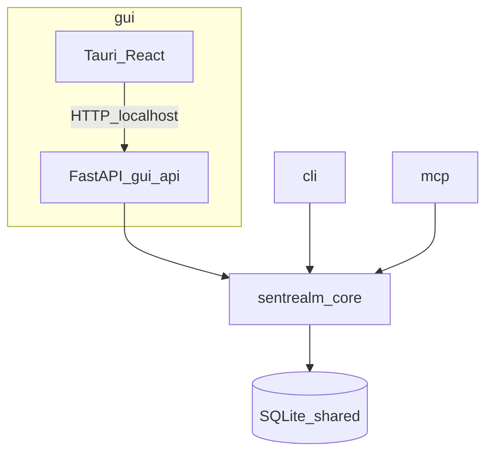

# 多入口模块化架构

> 协作约定见 [AGENTS.md](../../AGENTS.md)；系统分层见 [架构概览](./overview.md)；流水线细节见 [数据流](./data-flow.md)。本文档描述 **core / cli / gui / mcp** 四模块的职责与依赖。

## 目标

SentRealm 的预处理能力是**唯一业务内核**，通过四个独立入口对外提供服务：

| 模块 | 形态 | 用户场景 |
|------|------|----------|
| **core** | Python 库 | 被其他模块依赖，不直接面向用户 |
| **gui** | Tauri 桌面应用 | 主产品形态：预览、对照、复制 |
| **cli** | 命令行工具 | 脚本集成、管道处理、无 UI 场景 |
| **mcp** | MCP Server | Cursor 等 Agent 在写稿流程中调用预处理 |

业务规则以 [产品定义与 MVP](../planning/01-product-definition-and-mvp.md) 为准；gui 承载完整 MVP 体验，cli/mcp 为同等能力的无 UI 入口。

## 依赖关系



### 依赖铁律

| 模块 | 允许 | 禁止 |
|------|------|------|
| **core** | 流水线、领域模型、`SettingsStore`、LLM 客户端抽象 | HTTP、MCP、Tauri、React 依赖 |
| **gui/ui** | HTTP 调用 `gui/api` | import Python core |
| **gui/api** | FastAPI 路由；委托 `core` 与 `store` | 断句业务逻辑 |
| **cli** | 命令行解析；直接调 `core` + `store` | HTTP 调 gui/api |
| **mcp** | MCP tool 注册；直接调 `core` + `store` | HTTP 调 gui/api |

gui 的进程模型与 [架构概览](./overview.md) 一致：Tauri spawn 的仍是 `gui/api`（FastAPI 子进程），cli/mcp 为独立进程，不依赖 gui 是否运行。

## 四模块职责

| 模块 | 技术 | 职责 |
|------|------|------|
| **core** | 纯 Python 包 `sentrealm-core` | 8 步预处理流水线；`Settings` / `PreprocessResult` 模型；SQLite 配置读写；`LlmClient` 抽象与 mock |
| **gui** | Tauri + React + `gui/api` | 文稿输入与预览；参数配置 UI；spawn FastAPI；经 HTTP 暴露能力给 WebView |
| **cli** | Python + Typer | `sentrealm preprocess` 命令；读写文件/stdin/stdout |
| **mcp** | Python MCP SDK | stdio MCP server；暴露 `preprocess_text` tool |

## core 公开 API（概念）

脚手架阶段落地为 Python 包，对外保持稳定接口：

```python
# 概念示意，非最终实现

def preprocess(
    text: str,
    settings: Settings,
    llm_client: LlmClient | None = None,
) -> PreprocessResult: ...

class SettingsStore(Protocol):
    def load(self) -> Settings: ...
    def save(self, settings: Settings) -> None: ...

def default_config_path() -> Path: ...
```

| 类型 | 说明 |
|------|------|
| `Settings` | 去标点规则、单行最大字数预设、LLM endpoint/model 等 |
| `PreprocessResult` | 处理后文本、原文对照、`flagged_lines` 索引、行数统计 |
| `SettingsStore` | 配置持久化协议；默认实现为 SQLite |
| `LlmClient` | LLM 断句调用协议；可注入 mock |
| `default_config_path()` | 返回共用 SQLite 路径；Windows：`%APPDATA%/SentRealm/settings.db`（已定稿）；macOS/Linux 占位见 [ADR-004](./adr/004-sqlite-user-settings.md) |

## 各入口接入方式

### gui

- **ui**：React 经 `127.0.0.1:17300` 调用 `GET/PUT /api/v1/settings`、`POST /api/v1/preprocess`
- **api**（`apps/gui/api/`）：薄 FastAPI 层，`store.load()` → `core.preprocess()` → JSON 响应
- Tauri 负责 spawn `gui/api`、健康检查、`.txt` 文件导入

### cli

```bash
sentrealm preprocess -i draft.txt -o out.txt --preset landscape
sentrealm preprocess --stdin < draft.txt
```

- 直接 `store.load()` → `core.preprocess()` → 写 stdout 或 `-o` 文件
- 与 gui **共用同一 SQLite**，修改 gui 中的配置对 cli 生效
- 完整契约（参数、输出、退出码）见 [cli-mcp.md](../cli-mcp.md)

### mcp

- 独立进程：`uv run sentrealm-mcp`（stdio 传输）
- MVP 仅暴露 **`preprocess_text`** tool（入参 `text`、可选 `preset` / `max_chars`）
- 返回结构与 HTTP `PreprocessResponse` 一致；settings 读写 tools 二期再加
- 完整契约见 [cli-mcp.md](../cli-mcp.md)

## 共用配置（SQLite）

gui、cli、mcp 通过 `core` 的 `SettingsStore` 读写**同一 SQLite 文件**，路径由 `default_config_path()` 统一约定。

| 存储（本库） | 不存储（本库） |
|------|--------|
| 去标点保留/去除规则 | 文稿正文 |
| 横屏/竖屏/自定义字数预设 | 处理结果 / 处理历史 |
| `llm_enabled`、LLM endpoint、model | API 密钥 |

gui 文稿与最近处理结果落在 `Documents/SentRealm/`（[ADR-010](./adr/010-workspace-document-persistence.md)），**不是** SQLite；cli/mcp 不接入工作区。

详见 [ADR-004：SQLite 持久化用户配置](./adr/004-sqlite-user-settings.md)。

## MVP 边界

| 模块 | MVP 交付 | 不做 |
|------|----------|------|
| **core** | 完整流水线 + Settings + SQLite store + LlmClient 抽象 | HTTP、CLI 解析、MCP 注册 |
| **gui** | Tauri + React + `gui/api` | 断句逻辑 |
| **cli** | `sentrealm preprocess`（`-i` / `-o` / `--stdin` / `--preset`） | `config` 子命令；批量 |
| **mcp** | `preprocess_text` tool | settings tools；批量 |

## 目录结构（方案 A）

### 阶段 0：单仓库逻辑分层（脚手架 / MVP）— **目标结构**

先在同一仓库内划分逻辑边界，可共用一个根 `pyproject.toml`：

```
SentRealm/
  packages/
    core/
      src/sentrealm_core/
        pipeline/
        models.py
        store/
    cli/
      src/sentrealm_cli/
    mcp/
      src/sentrealm_mcp/
  apps/
    gui/
      src/              # React
      src-tauri/        # Tauri，spawn gui/api
      api/              # FastAPI → core
```

**本工作区现状**：上表目录（`packages/{core,cli,mcp}`、`apps/gui/{src,src-tauri,api}`）**已落地**。实现细节与延期项见 [implementation-status.md](../dev/implementation-status.md)。下方 [Phase 0 落地步骤](#phase-0-落地步骤) 为历史 checklist（M1 已完成），供边界验收对照，勿当作「尚未建树」。

### 阶段 1：拆 uv workspace（流水线稳定后）

- 根 `pyproject.toml` 声明 workspace members：`packages/core`、`packages/cli`、`packages/mcp`、`apps/gui/api`
- 各包独立依赖声明与 `uv sync`
- 正式决策与迁移细节见待写的 **ADR-009**（触发条件：流水线与依赖稳定）

## Phase 0 落地步骤

> **状态**：历史 checklist（M1 已完成）。下列步骤保留作依赖铁律与回归验收对照，勿当作「尚未建树」。

按下列顺序分离四模块（与 [ADR-007](./adr/007-multi-entry-modules.md) 选项 C 一致）。`gui/api` 不是第五个大模块，只是 gui 的薄 HTTP 层。

1. **目录落位**  
   建立 `packages/core`、`packages/cli`、`packages/mcp`、`apps/gui/{src,src-tauri,api}`。禁止在 `apps/gui/src`（React）内实现预处理算法。

2. **先 core**  
   - 公开面：`preprocess()`、`Settings` / `PreprocessResult`、`SettingsStore`、`LlmClient`、`default_config_path()`  
   - 包内：`pipeline/`、`models`、`store/`  
   - 禁止依赖：FastAPI、Typer、MCP SDK、React、Tauri

3. **再 gui/api（薄层）**  
   - 路由只做：`store.load()` → `core.preprocess()` → JSON；工作区读写遵循 [ADR-010](./adr/010-workspace-document-persistence.md)  
   - 禁止在 api 内实现断句步骤

4. **并行 cli / mcp**  
   - 各自解析入参 → `store.load()` → `core.preprocess()`  
   - **禁止**经 HTTP 调用 `127.0.0.1:17300`（gui/api）  
   - 命令与 tool 契约见 [cli-mcp.md](../cli-mcp.md)

5. **最后 gui UI**  
   - 仅经本地 HTTP 调 `gui/api`；主题与壳层见 [docs/ui/](../ui/README.md)

6. **验收铁律**  
   - 相同 `Settings` + 相同文稿 → gui / cli / mcp 结果一致  
   - 默认 `uv run pytest` 覆盖 core（注入 `MockLlmClient`）  
   - import 边界：core 无 HTTP；cli/mcp 不依赖 gui；React 不 import Python core

7. **阶段 1（日后）**  
   流水线稳定后撰写并执行 ADR-009：各包独立 `pyproject.toml` + uv workspace members。

## 相关文档

- [架构文档索引](./README.md)
- [架构概览](./overview.md)
- [数据流与模块边界](./data-flow.md)
- [ADR-007：多入口模块化](./adr/007-multi-entry-modules.md)
- [实现对照状态](../dev/implementation-status.md)
- [ADR 目录](./adr/README.md)
- [产品定义与 MVP](../planning/01-product-definition-and-mvp.md)
