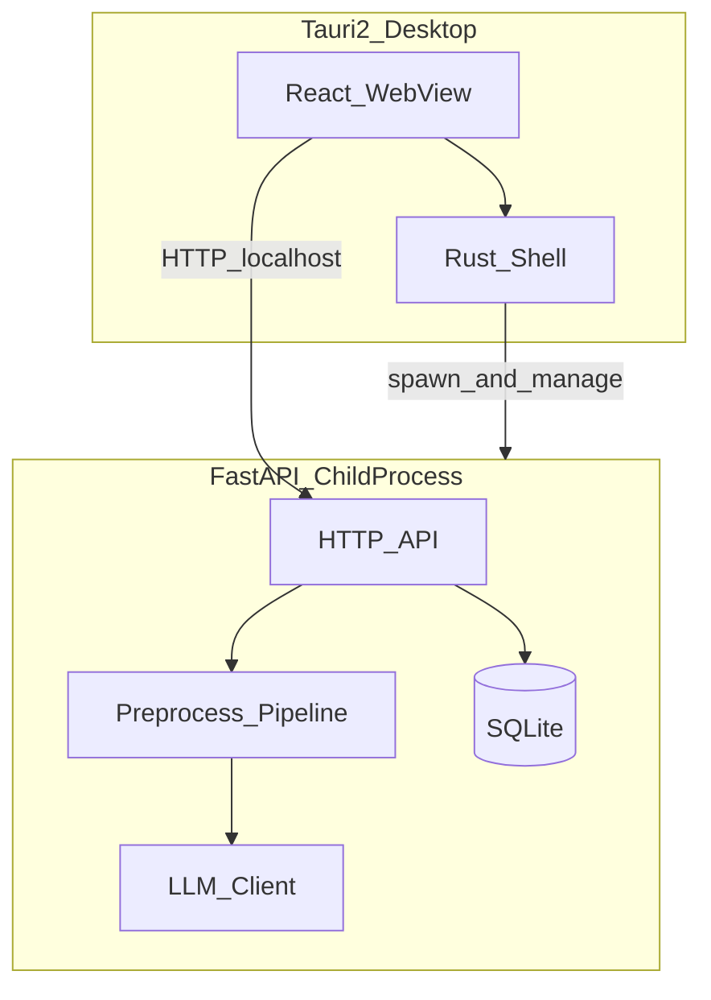

# 系统架构概览

> 技术栈与锁定版本以 [setup.md](../dev/setup.md) 与根 [README.md](../../README.md) 为准；业务规则以 [产品定义与 MVP](../planning/01-product-definition-and-mvp.md) 为准；Agent 协作约定见 [AGENTS.md](../../AGENTS.md)。本文档展开系统设计细节。

## 架构图

```
┌──────────────────────────────────────┐
│  Tauri 2（桌面壳 / Rust）              │
│  ┌────────────────────────────────┐  │
│  │  React + shadcn/ui + Tailwind │  │
│  └───────────────┬────────────────┘  │
│                  │ spawn / 管理         │
│  ┌───────────────▼────────────────┐  │
│  │  FastAPI 子进程（127.0.0.1）    │  │
│  └───────────────┬────────────────┘  │
└──────────────────┼───────────────────┘
                   │ HTTP（本地）
            ┌──────▼──────┐
            │ Python 后端  │
            │ FastAPI     │
            │ SQLite      │
            │ LLM（可选）  │
            └─────────────┘
```



## 分层说明

| 层 | 技术 | 职责 |
|----|------|------|
| 桌面壳 | Tauri 2 / Rust | 窗口与应用生命周期；**启动与停止 FastAPI 子进程**；后端健康检查；导出「另存为」等通过 Tauri dialog/fs 插件暴露（文稿目录内导出仍走工作区 HTTP） |
| 前端 | React + TypeScript；主壳为 OD 三栏布局（`AppShell` + `app-shell.css`）；shadcn/ui 用于基础控件与遗留调试页 | 文稿输入、参数配置、右侧结果预览、超长行高亮、一键复制；**不承载核心断句逻辑** |
| 后端 | FastAPI | 提供 REST API；编排预处理流水线；读写 SQLite 用户配置；gui 工作区文件读写 |
| 用户配置 | SQLite | 去标点规则、字数预设、`llm_enabled` / endpoint / model 等（[ADR-004](./adr/004-sqlite-user-settings.md)）；**不**存文稿正文 |
| 文稿资产（gui） | `Documents/SentRealm/` | 项目 / 文稿文件夹、`source.txt`、最近 `result.json`（[ADR-010](./adr/010-workspace-document-persistence.md)）；cli/mcp 不接入 |
| LLM | Python SDK | 规则后仍超长的行入发送池（每批 ≤10），质检不合格最多返工 3 次；未满足启用条件时跳过；测试环境使用 mock |

## 进程模型

开发与生产环境均采用同一模型：**由 Tauri（Rust）spawn 并管理 FastAPI 子进程**。

| 阶段 | 行为 |
|------|------|
| 应用启动 | 开发：`uv run uvicorn apps.gui.api.main:app --host 127.0.0.1 --port 17300`（`uv sync` 后，cwd = 仓库根）；生产：spawn PyInstaller sidecar（[ADR-008](./adr/008-production-packaging.md)） |
| 就绪检查 | Rust spawn 后不阻塞；前端 `waitForHealth` 轮询 `GET /health`（间隔 200ms，总超时 30s）；失败则 UI 提示「后端未就绪」 |
| 运行中 | 前端经 `get_api_base_url` 获取 `http://127.0.0.1:17300`；Rust 监控子进程；异常退出时 UI 提示「后端已停止」 |
| 应用关闭 | Tauri 退出时终止 FastAPI 子进程，避免残留后台进程 |

**开发体验**：用户执行 `pnpm dev` 即可一键启动；Tauri 在后台拉起后端，**无需手动开两个终端**。

详见 [ADR-006：Tauri 管理 FastAPI 子进程](./adr/006-tauri-spawn-fastapi.md)。

## 通信方式

前后端通过本地 HTTP 解耦，便于 Apifox 调试与独立测试后端。

| 约定 | 说明 |
|------|------|
| 协议 | HTTP |
| 绑定地址 | `127.0.0.1`（仅本机访问，不对外暴露） |
| 默认端口 | `17300`（被占用时启动失败，不自动换端口） |
| 路由前缀 | `/api/v1` |
| 健康检查 | `GET /health`（无版本前缀） |
| 错误响应 | FastAPI 默认 JSON：`{ "detail": "..." }` |

前端通过环境变量或 Tauri 注入获取后端 base URL（如 `http://127.0.0.1:17300`），避免硬编码。

详见 [ADR-003：前后端本地 HTTP 解耦](./adr/003-local-http-decoupling.md)。

## 持久化范围

### SQLite（用户配置，ADR-004）

| 存储 | 不存储 |
|------|--------|
| 去标点保留/去除规则 | 文稿正文 |
| 横屏/竖屏/自定义单行最大字数预设 | 处理结果 / 处理历史 |
| `llm_enabled`、LLM endpoint、model | **API 密钥** |

- API 密钥不入 SQLite、不入 git；通过环境变量 `SENTREALM_LLM_API_KEY` 配置，详见 [ADR-004](./adr/004-sqlite-user-settings.md) 与 [ADR-005](./adr/005-llm-integration-privacy.md)。

### 工作区目录（gui 文稿，ADR-010）

| 存储 | 说明 |
|------|------|
| 项目 / 文稿元数据 | `workspace.json`、`project.json`、`document.json` |
| 正文 | 每文稿 `source.txt`（UTF-8） |
| 最近处理结果 | 可选 `result.json`（不含 `original`） |

- cli / mcp **不**接入工作区；仍仅内存处理输入文本。
- `POST /api/v1/preprocess` **本身不自动写盘**；gui 经独立 workspace / documents API 读写文件。

详见 [ADR-004](./adr/004-sqlite-user-settings.md)、[ADR-010](./adr/010-workspace-document-persistence.md)。

## 模块视图

除上述分层架构外，系统按 **core / cli / gui / mcp** 四个模块组织：业务逻辑集中在 `core`，gui 经 `gui/api`（FastAPI）为 React 提供服务，cli 与 mcp 直接调用 `core` 且不依赖 gui 是否运行。四模块共用同一 SQLite 配置。

**如何落地分离**（目录顺序、依赖验收）：见 [modules.md § Phase 0 落地步骤](./modules.md#phase-0-落地步骤)；决策背景见 [ADR-007](./adr/007-multi-entry-modules.md)。

详见 [多入口模块化架构](./modules.md)。

## 相关文档

- [架构文档索引](./README.md)
- [多入口模块化架构](./modules.md)
- [数据流与模块边界](./data-flow.md)
- [ADR 目录](./adr/README.md)
- [ADR-010：文稿与项目本地持久化](./adr/010-workspace-document-persistence.md)
- [产品定义与 MVP](../planning/01-product-definition-and-mvp.md)
- [API 文档](../api/README.md)
