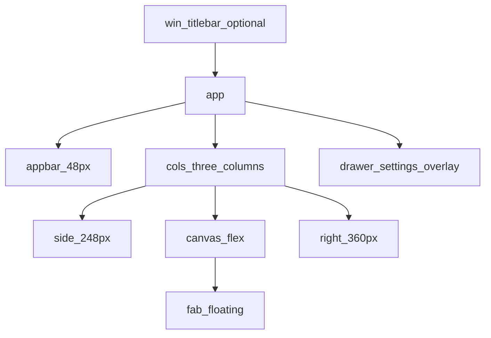

# Layout — 应用壳与 Tauri WebView

> 壳层来源：OD `assets/app.css`（`.win` / `.app` / `.cols` / `.drawer`）。  
> 落地文件：`apps/gui/src/styles/app-shell.css`（架构文档称 `app-shell.css`）。

## 结构总览

| 区域 | OD class | 职责 |
|------|----------|------|
| 窗口装饰 | `.win` / `.win-titlebar` | 原型用自定义标题栏；**Tauri 可用系统装饰**，实现时可省略 `.win` 或仅保留拖拽区 |
| 顶栏 | `.appbar` | 面包屑、快捷键提示、设置入口 |
| 左栏 | `.side` | 品牌、搜索、新建、文稿列表、健康状态、设置 |
| 中栏 | `.canvas` | 文稿标题、导入/预设 pill、编辑器、底部 FAB |
| 右栏 | `.right` | 处理结果列表、统计、一键复制 |
| 设置 | `.drawer` + `.scrim` | 右侧滑出设置；≤960px 变底栏 sheet |

## 网格与断点

| 视口 | 行为 |
|------|------|
| 默认（设计宽约 1440） | `248 \| 1fr \| 360` |
| `.cols.no-right` | 隐藏右栏（空态可无结果列） |
| `.cols.collapsed` | 左栏收至 56px |
| `max-width: 1024px` | 左栏 mini；右栏改为绝对定位抽屉（`.shell-right.is-open` + scrim） |
| `max-width: 960px` | 设置 `.drawer` → 底部 sheet（高约 80vh） |
| `max-width: 800px` 或 `max-height: 600px` | FAB 全宽化；画布内边距缩小 |

**最小可用窗口**：设计按 **≥800×600** 保证主操作可达。Tauri `tauri.conf` 已设 `minWidth: 800` / `minHeight: 600`。

## 快捷键（Wave B 已落地）

| 键 | 行为 |
|----|------|
| `Ctrl+,` | 开/关设置 Drawer |
| `/` | 聚焦侧栏搜索（编辑器/输入框内不触发） |
| `Esc` | 依次关闭：删除确认 → 预设 popover → **规则 Modal**（含脏确认）→ 设置 → 窄屏结果抽屉 |

## 中栏与 FAB

- 编辑器：`.editor` + `.ta`（textarea）；空态 `.editor-empty`。  
- 浮动操作栏：`.fab` 绝对定位于 canvas 底部居中（`bottom: 24px`），含预设切换、状态文案、**编辑规则**、**处理文稿**主按钮。  
- `canvas-body` 底部 padding 需为 FAB 留空：`calc(var(--fab-h) + 32px + 32px)`。

## 设置 Drawer

- 打开：`.scrim` + `.drawer`（宽约 420px 级，见 app.css）。  
- 分区：字数与断句、LLM、隐私（见 [screens.md](./screens.md)）。  
- **不**用 shadcn `Sheet` 替换主设置（ADR-002）；`VerifyPage` 等次要页可用 shadcn Dialog/Sheet。

## Tauri 2 注意点

| 主题 | 约定 |
|------|------|
| 装饰 | 系统标题栏时去掉原型 `.win-titlebar`；保留应用内 `.appbar` |
| WebView | 标准 DOM + CSS；避免依赖浏览器扩展 API |
| 滚动 | `body { overflow: hidden }`；滚动落在 `.side-history` / `.canvas-body` / `.right-body` |
| 剪贴板 | 一键复制走 Tauri / Web Clipboard API（产品 US-06） |
| 文件导入 | `.txt` 经 Tauri 文件对话框（US-02） |
| 后端状态 | 侧栏 `.health` 与顶层 banner 同步 ADR-006 健康检查 |

## 与 React 分层

| 层 | 职责 |
|----|------|
| `app-shell.css` | 三栏几何、壳组件 class、动画 |
| Tailwind + shadcn | 表单控件、toast、次要页、可访问性原语 |
| 业务组件 | 调 `gui/api` HTTP；**不含**断句逻辑（ADR-007） |

## 相关

- [foundations.md](./foundations.md) · [screens.md](./screens.md)  
- [overview.md](../architecture/overview.md) · [ADR-001](../architecture/adr/001-tauri-desktop-shell.md) · [ADR-006](../architecture/adr/006-tauri-spawn-fastapi.md)
