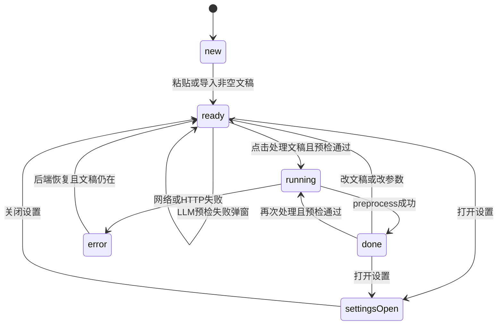

# States — 交互与系统状态

> 对齐 OD boards、`assets/app.js` 注释，以及 [ADR-006](../architecture/adr/006-tauri-spawn-fastapi.md) / 用户故事 US-08、US-16。

## 处理流状态机

| 状态 | UI 要点 |
|------|---------|
| `new` | 编辑空态 hint；FAB 主按钮可禁用或提示先输入；右栏 empty |
| `ready` | `data-processable=true`；FAB「已就绪」+ 预计耗时；可点 **处理文稿**。若已启用 LLM：点击后先调 `POST /settings/llm-test`；失败弹窗，**不进入** `running` |
| `running` | FAB `.is-running`；spinner；文案「正在断句…」；主按钮 disabled；右栏经 SSE（`/preprocess/stream`）**渐进刷新**中间结果 |
| `done` | 右栏结果（行号、每行字数、分栏统计）；超长行 `.long`；复制 / 导出可用；统计含「超限」时用 `--warn`；FAB 主按钮「重新处理」 |
| `error` | banner + 侧栏 `.health.err`；禁用处理 |
| `settings-open` | drawer + scrim；背后 canvas 降亮度 |
| `rules-open` | 居中规则 Modal + scrim；与 settings 互斥入口（FAB） |

## 后端健康（侧栏 `.health`）

| 表现 | 文案（与用户手册一致） | 点颜色 |
|------|------------------------|--------|
| 就绪 | 后端已就绪 · `17300` | `--ok` |
| 启动中 | （原型 Starting） | `--warn` + pulse |
| 未就绪 / 不可达 | 后端未就绪 | `--err` |
| 已停止 | 后端已停止 | `--err` |

前端 `waitForHealth`：间隔 200ms、总超时 30s（ADR-006）。Rust 仅负责 spawn，不阻塞等 health。

## 错误 Banner（Board 05）

实现组件：`BackendBanner`；`BannerKind` 映射：

| Kind | 触发 | 标题意图 |
|------|------|----------|
| `starting` | health 启动中 | 正在连接后端 · 17300 |
| `unavailable` | health error（未曾 ready） | 后端不可达 / 端口占用 |
| `stopped` | health error（曾 ready） | 后端已停止 |
| `process_http` | preprocess 5xx | 处理失败 · 可重试 |
| `process_validation` | preprocess 422 / 空文稿 | 文稿或参数无效 |
| `network` | fetch 失败 / bootstrap 网络错误 | 网络请求失败 |

可关闭；关闭不假装后端已好——侧栏 `.health` 仍反映真实 `useBackend.status`。

## 超长行标记

- 数据：`flagged_lines: number[]`（0-based）  
- 样式：`.result-line.long` + 可选 `超长` 标签  
- 复制：**仍包含**该行正文（产品：标记不删内容）  
- 无 LLM 时更多标记是预期（US-09），非错误态  

## 复制反馈

| 态 | UI |
|----|-----|
| 默认 | `.btn-copy` 白底主按钮风格 |
| 成功 | `.copied` → `--ok-soft` 底 + `--ok` 字；可叠加 sonner toast |
| 禁用 | 无结果时 disabled |

## LLM 设置态

| 态 | `.llm-status` |
|----|---------------|
| 未配置 | 灰点；说明超长行仅标记 |
| 已配置可启用 | 绿点（endpoint + model + 环境变量密钥均有效） |

密钥 UI **只显示是否配置**，不展示明文、不提供写入 SQLite 的输入框。

## 验收对照

| 故事 | 状态文档覆盖 |
|------|----------------|
| US-01 处理 | ready → running → done |
| US-05/08 预览与标记 | done + `.long` |
| US-06 复制 | `.btn-copy` / `.copied` |
| US-16 后端未就绪 | error + health.err |

## 相关

- [screens.md](./screens.md) · [components.md](./components.md)  
- [data-flow.md](../architecture/data-flow.md) · [用户手册 §7](../user/README.md)
